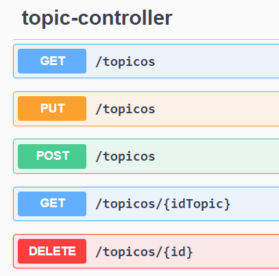
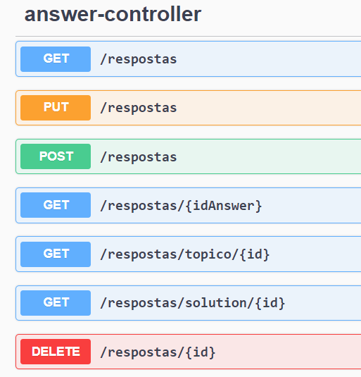
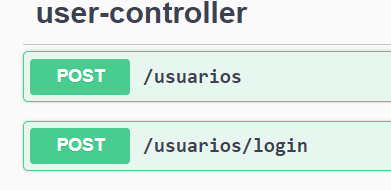

# :bookmark_tabs: Challenge Forum Hub 
Challenge de construção de uma API Restful de um fórum, que inclui persistências e acessos de usuários, tópicos e respostas, implementado com Spring Boot e MySQL. 
Proposto pela Oracle Next Education, na formação de Back-end Java, em parceria com a Alura.

 

  

 

## :wrench: Sobre o projeto
- Uma API Rest simples e robusta, estruturada utilizando as melhores práticas de programação, arquitetada com a idéia do "Clean Architecture" e "MVC", os quais permitem a organização do código por camadas como: domain, infra e controller.
- O objetivo da API é realizar a persistência de tópicos e suas respectivas respostas, além de cadastro de usuários com autenticação de tokens, e permitir o acesso desses dados em formato JSON, para manipulação no front-end.
- A API fornece endpoints para interação, e cada endpoint tem sua função (persistência ou busca) implementadas também com os verbos HTTP respectivos, além de nível de acesso para endpoints que realizam funções mais sensíveis.
- É possível conhecer todos os endpoints através da documentação do Spring Doc, acessando a URL em que o projeto está hospedado com "/swagger-ui/index.html" no caminho, exemplo: "http://localhost:8080/swagger-ui/index.html";

## :clipboard: Como funciona?
- Todos os endpoints necessitam de autenticação por tokens no padrão JWT.
- Apenas o endpoint "POST /usuarios" é livre de autenticação e disponível para acesso geral, justamente por ser o endpoint que realiza o login do usuário e retorna um token JWT válido para uso em outras requisições.
> O formato padrão de retorno dos dados serializados é o formato JSON (JavaScript Object Notation).

## :globe_with_meridians: Endpoints

### Tópicos
 

  

 

### Respostas
 

  

 

### Usuários
 

  

 

## :computer: Tecnologias e ferramentas utilizadas
- Java (JDK 17)
- Spring Boot e JPA Hibernate
- Spring Security e Spring Doc
- Bean Validation, Lombok e Flyway
- Auth0 para tokens JWT
- IntelliJ e Git
- [MySQL](https://www.mysql.com)
